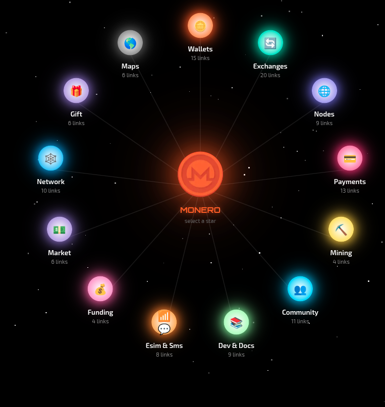
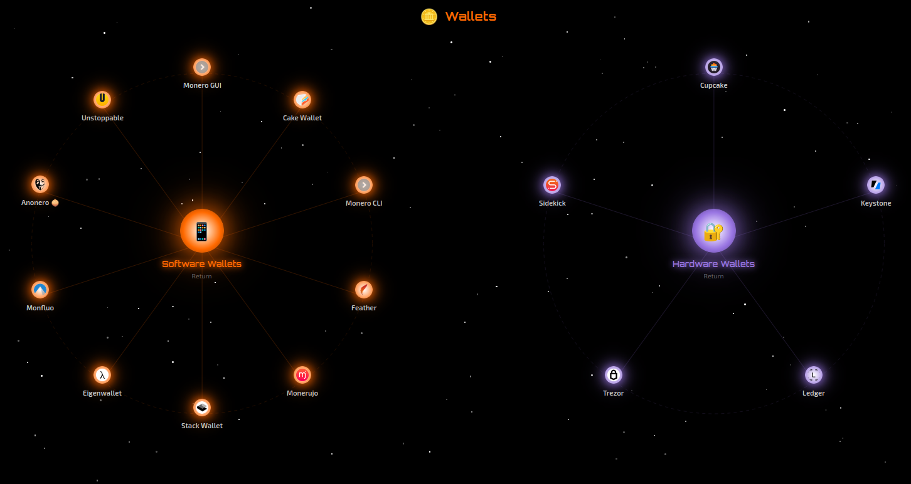

# Monero EcoSystem

### See the new constellation of the MONERO EcoSystem

An interactive constellation-style web directory that maps the Monero (XMR) ecosystem. 
Browse wallets, exchanges, nodes, payment solutions, mining tools, and community resources 
through a visually engaging star-map interface.

---

 

[▶ Explore the Monero Ecosystem](https://easynode.kerlann.org/ecosystem.html)

---

## Overview

XMR Ecosystem is a single-page application that organizes Monero-related services and tools into navigable categories, rendered as an animated constellation. Each category appears as a star orbiting a central node, and clicking on one reveals the individual projects within it.

The directory currently references **120+ curated links** across **12 categories**.

## Categories

| Category | Description |
|:---|:---|
| **Wallets** | Software and hardware wallets (Feather, Cake Wallet, Monerujo, Ledger, Trezor, etc.) |
| **Exchanges** | DEX/Swaps and CEX/Fiat on-ramps (Haveno, Trocador, FixedFloat, Kraken, etc.) |
| **Nodes** | Tools to run your own Monero node (EasyMonerod, PiNodeXMR, Umbrel, MoneroNodo, etc.) |
| **Payments** | Payment processors and prepaid card services (BTCPay Plugin, MoneroPay, Trocador Cards, etc.) |
| **Mining** | Mining software and pool statistics (P2Pool, XMRig, Gupax) |
| **Community** | News outlets, forums, conferences, and community hubs |
| **Dev & Docs** | Documentation, research publications, and educational resources |
| **eSIM & SMS** | Privacy-oriented eSIM and virtual phone number providers |
| **Funding** | Crowdfunding and bounty platforms (CCS, Kuno, XMR Chat) |
| **Market** | Merchant directories and marketplaces accepting Monero |
| **Network** | VPNs, hosting providers, privacy-focused email, and DNS services |
| **Gift** | Gift card platforms that accept Monero (Cakepay, Coinsbee, XmrCards, etc.) |
| **Maps** | Geographic maps of ATMs, merchants, and public nodes |

## Features

- **Constellation navigation** — Categories orbit a central Monero star; click to zoom into sub-links.
- **Dual-sun layout** — Categories with sub-groups (Wallets, Exchanges, Payments) display two orbiting clusters side by side.
- **Animated starfield** — Procedurally generated background with twinkling stars and constellation lines.
- **Responsive design** — Adapts to desktop, tablet, and mobile viewports (including dynamic viewport height for mobile browsers).
- **Tooltips** — Hover over any node to see a short description of the service.
- **Info panel** — Click a node to open a panel with a direct link to the project.

## Tech Stack

- Pure HTML, CSS, and vanilla JavaScript — no build step, no dependencies
- Canvas API for constellation lines and orbit circles

## Contributing

Submit a pull request with a brief explanation of the change.
Please verify that any service you add is functional and relevant to the Monero ecosystem.

## License

This project is licensed under the [GNU General Public License v3.0](LICENSE). You are free to use, modify, and redistribute this software, provided that any derivative work is also distributed under the same license. See the `LICENSE` file for full terms.

## Acknowledgments

Built for the Monero community. All listed projects and services are maintained by their respective teams.
